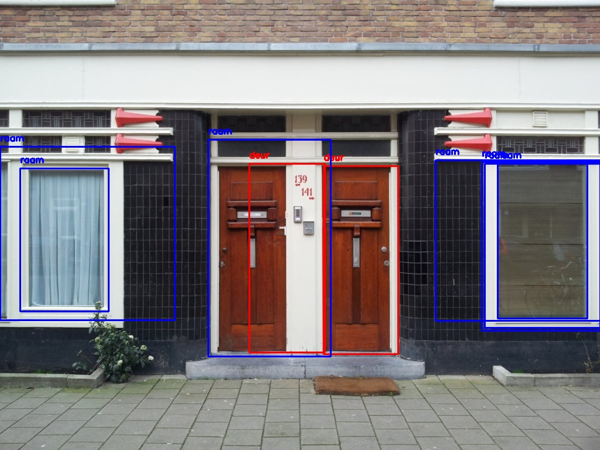
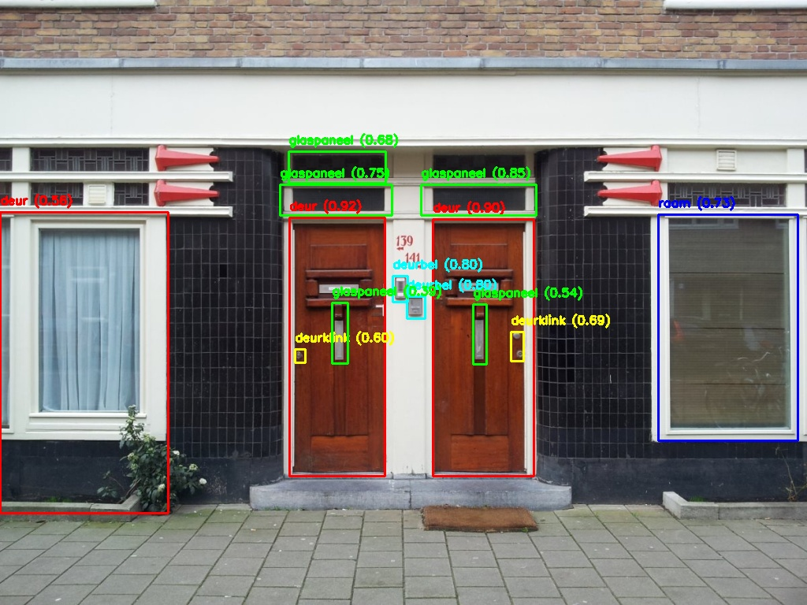

# Door Detection and Analysis using Computer Vision

This project was developed as part of the **Computer Vision** final assignment at the Amsterdam University of Applied Sciences. Its goal is to create an application capable of automatically detecting and analyzing doors and their features from images, focusing on reusability of materials in urban environments.

## Table of Contents
- [Overview](#overview)
- [Features](#features)
- [Dataset](#dataset)
- [Methodology](#methodology)
- [Technologies](#technologies)
- [Installation](#installation)
- [Usage](#usage)
- [Results](#results)


## Overview
This application detects and classifies doors and their features, including:
- Dimensions and width/height ratio
- Position of the door handle and mailbox
- Ratio of wood and glass materials in the door

The project compares traditional computer vision techniques with deep learning methodologies to provide an efficient and robust solution.

## Features
- Detection and classification of doors using traditional techniques (e.g., edge detection and contour detection).
- Detection and classification with deep learning (YOLOv11x model).
- Data storage in an Excel database with metadata such as dimensions, colors, and positions.
- Storage of screenshots of detected objects for further analysis.

## Dataset
The dataset comprises:
- **40% self-taken images** (captured in Amsterdam neighborhoods).
- **60% Google Street View images**.
All images are standardized for lighting, perspective, and resolution to ensure consistent results.

## Methodology
### Traditional Method
Uses techniques such as:
- Sobel and Canny edge detection
- Contour filtering based on aspect ratio

### Deep Learning
Employs a YOLOv11x model trained on a curated dataset. Transfer learning is applied to achieve better performance with a relatively small dataset.

## Technologies
- **Python**
- **OpenCV** for computer vision
- **Roboflow API** for deep learning
- **Pandas** and **ExcelWriter** for data storage

## Installation
1. Clone this repository:
   ```bash
   git clone https://github.com/Esiwehl/DoorDetection.git
   cd DoorDetection
    ```
2. Install the required packages:
   ```bash
   pip install -r requirements.txt
   ```
3. Ensure you have a Roboflow API key to use the deep learning models.

## Usage
1. PLace images in the data/images directory.
2. Run the script to perform detection.
    ```bash
    python3 detect.py
    ```
3. View the results in the generated detected_objects dir and the Excel 'database'.

## Results
### Conventional Method result

### Deep Learning Method result


Here's a basic overview of the performance of traditional techniques and deep learning:

| Aspect                  | Traditional  | Deep Learning |
|-------------------------|--------------|---------------|
| Detection Accuracy      | Low          | High          |
| Sensitivity to Noise    | High         | Low           |
| Generalizability        | Very Limited | High          |


I wrote a report on this with more details in Dutch, feel free to reach out if interested!
